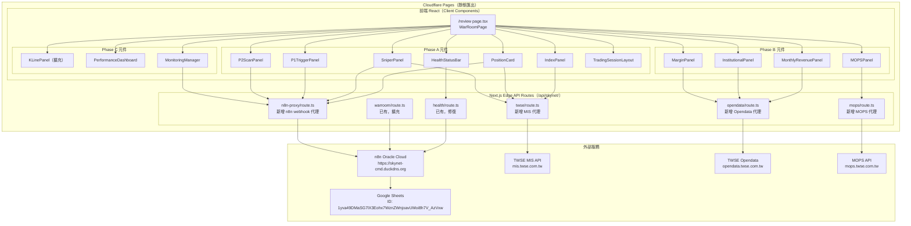
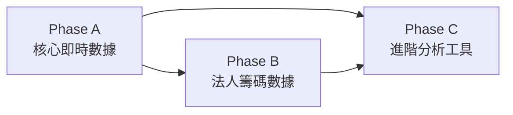

# Design Document: Dashboard War Room Upgrade

## Overview

本設計將 SkyNet Dashboard 的戰情室（`/review` 路由）從現有的「今日 AI 戰報 + 狙擊清單 + 大盤情報」單一頁面，升級為類 MOPS 公開資訊觀測站的專業交易指揮中心。

升級分三個 Phase：
- **Phase A**：修復健康檢查、新增持倉損益卡片、狙擊候選即時狀態、大盤指數、P1/P2 輸出整合、三時段自適應佈局
- **Phase B**：MOPS 重大訊息、月營收、三大法人、融資融券
- **Phase C**：個股 K 線圖（擴充現有 KLinePanel）、個人績效儀表板、自選監控管理介面

### 技術約束摘要

| 約束 | 說明 |
|---|---|
| 部署平台 | Cloudflare Pages（靜態匯出） |
| Runtime | 所有 API routes 必須 `export const runtime = 'edge'` |
| CORS | 外部 API 不得從前端直接呼叫，必須透過 Next.js API routes 代理 |
| 狀態管理 | 純 React hooks（`useState`/`useEffect`/`useCallback`），不使用 SSR 狀態管理 |
| 框架 | Next.js 15 App Router + TypeScript + Tailwind CSS v4 + Recharts v3 |

---

## Architecture

### 整體架構圖



### 資料流設計

所有外部 API 呼叫均透過 Edge API Routes 代理，前端只與 `/api/skynet/*` 通訊：

```
前端元件
  → fetch('/api/skynet/twse?tickers=t99,0050')
  → Edge Route（TWSE proxy）
  → fetch('https://mis.twse.com.tw/stock/api/getStockInfo.asp?ex_ch=tse_t99.tw|tse_0050.tw')
  → 標準化回應 → 前端
```

### Phase 分層與依賴關係



- **Phase A** 是基礎，修復現有問題並建立新 API routes（TWSE MIS 代理、n8n proxy 擴充）
- **Phase B** 依賴 Phase A 建立的 TWSE Opendata 代理與 MOPS 代理
- **Phase C** 依賴 Phase A 的持倉數據（KLinePanel 目標價/停損價標示）

---

## Components and Interfaces

### Phase A 元件樹

```
WarRoomPage（/review/page.tsx）
├── HealthStatusBar          # 頂部連線狀態列（修復）
├── TradingSessionBadge      # 時段標籤（開盤前/盤中/收盤後/非交易日）
├── TradingSessionLayout     # 三時段自適應佈局容器
│   ├── [開盤前] AlphaPanel  # 晨間報告摘要（現有 warroom tab 內容）
│   ├── [盤中]
│   │   ├── IndexPanel       # 大盤指數（新增）
│   │   ├── PositionCard     # 持倉即時損益（新增）
│   │   └── SniperPanel      # 狙擊候選狀態（擴充現有）
│   └── [收盤後]
│       ├── P1TriggerPanel   # 止盈止損觸發紀錄（新增）
│       └── P2ScanPanel      # 收盤選股結果（新增）
└── [手動切換] SessionTabBar # 允許手動切換時段
```

### Phase B 元件樹（追加到 WarRoomPage）

```
WarRoomPage
└── PhaseB_Section
    ├── MOPSPanel            # 重大訊息（新增）
    ├── MonthlyRevenuePanel  # 月營收（新增）
    ├── InstitutionalPanel   # 三大法人（新增）
    └── MarginPanel          # 融資融券（新增）
```

### Phase C 元件樹（追加到 WarRoomPage）

```
WarRoomPage
├── KLinePanel（擴充）       # 新增目標價/停損價水平線
├── PerformanceDashboard     # 個人績效（新增）
└── MonitoringManager        # 自選監控管理（新增）
```

### Props 介面定義

```typescript
// ── HealthStatusBar ──────────────────────────────────
interface HealthStatusBarProps {
  health: { n8n: ServiceStatus; sheets: ServiceStatus };
  onRefresh: () => void;
}

// ── IndexPanel ───────────────────────────────────────
interface IndexQuote {
  symbol: string;       // 'TAIEX' | '0050'
  name: string;
  price: number;
  change: number;
  changePercent: number;
  isTrading: boolean;
}
interface IndexPanelProps {
  quotes: IndexQuote[];
  loading: boolean;
  error: string | null;
  lastUpdated: string | null;
}

// ── PositionCard ─────────────────────────────────────
interface Position {
  ticker: string;
  name: string;
  shares: number;
  avgCost: number;
  currentPrice: number | null;
  pnl: number | null;           // 浮動損益（元）
  returnRate: number | null;    // 報酬率（%）
  targetPrice?: number;
  stopPrice?: number;
  type: 'ETF' | '個股';
}
interface PositionCardProps {
  positions: Position[];
  loading: boolean;
  error: string | null;
  isTrading: boolean;
  lastUpdated: string | null;
  onTickerClick: (ticker: string) => void;
}

// ── SniperPanel ──────────────────────────────────────
interface SniperItem {
  ticker: string;
  name: string;
  triggerPrice: number;
  stopPrice: number;
  currentPrice: number | null;
  distPct: number | null;       // 距觸發%
  status: '待觸發' | '已觸發' | '已撤退';
  source: '/watch' | 'POST_MARKET_SCAN';
  date: string;
}
interface SniperPanelProps {
  snipers: SniperItem[];
  loading: boolean;
  error: string | null;
  isTrading: boolean;
  onTickerClick: (ticker: string) => void;
  onRetreat: (ticker: string) => void;
}

// ── P1TriggerPanel ───────────────────────────────────
interface P1Trigger {
  ticker: string;
  name: string;
  triggerType: '止盈' | '止損';
  triggerPrice: number;
  triggeredAt: string;
}
interface P1TriggerPanelProps {
  triggers: P1Trigger[];
  loading: boolean;
  error: string | null;
}

// ── P2ScanPanel ──────────────────────────────────────
interface P2Candidate {
  ticker: string;
  name: string;
  confidence: number;
  triggerPrice: number;
  source: 'POST_MARKET_SCAN';
}
interface P2ScanPanelProps {
  candidates: P2Candidate[];
  loading: boolean;
  error: string | null;
  onTickerClick: (ticker: string) => void;
}

// ── Phase B ──────────────────────────────────────────
interface MOPSAnnouncement {
  ticker: string;
  companyName: string;
  title: string;
  announcedAt: string;
  url: string;
}
interface MonthlyRevenue {
  ticker: string;
  name: string;
  revenue: number;       // 百萬元
  momChange: number;     // 月增率%
  yoyChange: number;     // 年增率%
  period: string;        // YYYY/MM
}
interface InstitutionalData {
  foreign: { buy: number; sell: number; net: number };
  trust: { buy: number; sell: number; net: number };
  dealer: { buy: number; sell: number; net: number };
  date: string;
}
interface MarginData {
  ticker: string;
  name: string;
  marginBalance: number;
  marginChange: number;
  shortBalance: number;
  shortChange: number;
  isClean: boolean;      // 融資減少且股價上漲
}

// ── Phase C ──────────────────────────────────────────
interface PersonalTrade {
  ticker: string;
  name: string;
  buyCost: number;
  sellPrice: number | null;
  pnl: number | null;
  returnRate: number | null;
  date: string;
}
interface PerformanceSummary {
  totalTrades: number;
  winRate: number;
  avgReturn: number;
  maxDrawdown: number;
  trades: PersonalTrade[];
  equityCurve: { date: string; cumReturn: number }[];
}
interface MonitoringEntry {
  ticker: string;
  name: string;
  shares: number;
  avgCost: number;
  targetPrice: number | null;
  stopPrice: number | null;
  type: 'ETF' | '個股';
}
```

---

## Data Models

### API 回應格式

#### TWSE MIS API（`/api/skynet/twse`）

```typescript
// 請求：GET /api/skynet/twse?tickers=t99,0050
// 外部 URL：https://mis.twse.com.tw/stock/api/getStockInfo.asp?ex_ch=tse_t99.tw|tse_0050.tw

interface TWSEMISItem {
  symbol: string;       // 代號（去除 tse_/otc_ 前綴）
  name: string;
  price: number;        // 現價（z 欄位）
  change: number;       // 漲跌（z - y）
  changePercent: number;
  open: number;
  high: number;
  low: number;
  prevClose: number;    // y 欄位
  volume: number;       // v 欄位（張）
  timestamp: string;    // t 欄位
}

interface TWSEMISResponse {
  items: TWSEMISItem[];
  fetchedAt: string;
}
```

#### TWSE Opendata API（`/api/skynet/opendata`）

```typescript
// 請求：GET /api/skynet/opendata?type=institutional
// 外部 URL：https://opendata.twse.com.tw/v1/exchangeReport/BWIBBU_d

interface OpendataResponse {
  type: 'institutional' | 'margin' | 'revenue';
  data: unknown[];      // 依 type 不同結構
  fetchedAt: string;
}
```

#### n8n Webhook 代理（`/api/skynet/n8n-proxy`）

```typescript
// 請求：GET /api/skynet/n8n-proxy?type=positions
// 外部 URL：https://skynet-cmd.duckdns.org/webhook/skynet-dashboard?type=positions

// type 值：
// - positions       → 【自選監控】持倉清單
// - p1_triggers     → 當日止盈止損觸發紀錄
// - snipers         → 【狙擊候選】清單
// - personal_performance → 個人績效數據
// - update_monitoring（POST）→ 更新目標價/停損價
```

#### MOPS 代理（`/api/skynet/mops`）

```typescript
// 請求：GET /api/skynet/mops?tickers=2330,00878
// 外部 URL：https://mops.twse.com.tw/mops/web/ajax_t05st01

interface MOPSResponse {
  announcements: MOPSAnnouncement[];
  fetchedAt: string;
}
```

### 狀態管理模型（前端）

```typescript
// WarRoomPage 頂層狀態
interface WarRoomState {
  // 時段
  tradingSession: 'pre-market' | 'trading' | 'post-market' | 'weekend';
  manualSession: 'pre-market' | 'trading' | 'post-market' | null; // null = 自動

  // Phase A
  health: { n8n: ServiceStatus; sheets: ServiceStatus };
  indexQuotes: IndexQuote[];
  positions: Position[];
  snipers: SniperItem[];
  p1Triggers: P1Trigger[];
  p2Candidates: P2Candidate[];

  // Phase B
  mopsAnnouncements: MOPSAnnouncement[];
  monthlyRevenues: MonthlyRevenue[];
  institutional: InstitutionalData | null;
  margins: MarginData[];

  // Phase C
  performance: PerformanceSummary | null;
  monitoring: MonitoringEntry[];

  // UI
  klineTicker: string | null;
  activeTab: string;
}
```

---

## API Routes Design

### 現有 routes（修復/擴充）

#### `GET /api/skynet/health`（修復）

現有實作已正確，但前端輪詢間隔需從「頁面載入時」改為「每 60 秒」。API 本身不需修改。

#### `GET /api/skynet/warroom`（擴充）

現有 route 已代理 n8n webhook，新增 `type` 參數支援：
- `type=p1_triggers` → 止盈止損觸發紀錄
- `type=positions` → 持倉清單（轉移到 n8n-proxy，或保留在此）

### 新增 routes

#### `GET /api/skynet/twse`（新增）

```typescript
// src/app/api/skynet/twse/route.ts
export const runtime = 'edge';

// 請求參數：?tickers=t99,0050,2330
// tickers 格式：逗號分隔，上市用 tse_ 前綴，上櫃用 otc_ 前綴
// t99 = 加權指數（特殊代號）

// 外部 API：
// https://mis.twse.com.tw/stock/api/getStockInfo.asp
//   ?ex_ch=tse_t99.tw|tse_0050.tw|tse_2330.tw

// 回應欄位對應（TWSE MIS 原始欄位）：
// z = 現價, y = 昨收, o = 開盤, h = 最高, l = 最低
// v = 成交量（張）, t = 時間, n = 名稱, c = 代號

// 逾時：5 秒
// 快取：Cache-Control: public, max-age=25（配合前端 30 秒輪詢）
```

#### `GET /api/skynet/opendata`（新增）

```typescript
// src/app/api/skynet/opendata/route.ts
export const runtime = 'edge';

// 請求參數：?type=institutional|margin|revenue&tickers=2330,00878

// type=institutional
//   外部 URL：https://opendata.twse.com.tw/v1/exchangeReport/BWIBBU_d
//   回傳：三大法人整體買賣超

// type=margin（融資融券）
//   外部 URL：https://opendata.twse.com.tw/v1/exchangeReport/MI_MARGN
//   回傳：指定 tickers 的融資融券餘額

// type=revenue（月營收）
//   外部 URL：https://opendata.twse.com.tw/v1/financialStatements/MONTHLY_REVENUE
//   回傳：指定 tickers 的最新月營收

// 逾時：8 秒
// 快取：Cache-Control: public, max-age=300（5 分鐘，法人數據更新頻率低）
```

#### `GET /api/skynet/mops`（新增）

```typescript
// src/app/api/skynet/mops/route.ts
export const runtime = 'edge';

// 請求參數：?tickers=2330,00878（逗號分隔）

// 外部 URL：https://mops.twse.com.tw/mops/web/ajax_t05st01
//   POST body：co_id={ticker}&b_date=YYYYMMDD&e_date=YYYYMMDD

// 策略：對每支 ticker 發出請求，合併結果，取最新 10 則
// 逾時：10 秒（MOPS 回應較慢）
// 快取：Cache-Control: public, max-age=600（10 分鐘）

// 降級：MOPS 無法存取時回傳 { announcements: [], error: 'mops_unavailable' }
```

#### `GET|POST /api/skynet/n8n-proxy`（新增）

```typescript
// src/app/api/skynet/n8n-proxy/route.ts
export const runtime = 'edge';

// GET /api/skynet/n8n-proxy?type=positions
//   → 代理到 https://skynet-cmd.duckdns.org/webhook/skynet-dashboard?type=positions

// GET /api/skynet/n8n-proxy?type=p1_triggers
//   → 代理到 ?type=p1_triggers

// GET /api/skynet/n8n-proxy?type=personal_performance
//   → 代理到 ?type=personal_performance

// POST /api/skynet/n8n-proxy
//   body: { type: 'update_monitoring', ticker, targetPrice, stopPrice }
//   → 代理到 POST https://skynet-cmd.duckdns.org/webhook/skynet-dashboard

// 逾時：GET 8 秒，POST 10 秒
// 注意：此 route 整合現有 warroom/route.ts 的功能，
//       warroom route 保留向後相容，n8n-proxy 為新的統一代理入口
```

---

## Error Handling

### 降級策略矩陣

| API | 失敗情境 | 降級行為 | 影響範圍 |
|---|---|---|---|
| `/api/skynet/health` | n8n 無法連線 | 顯示紅色指示燈 | 僅狀態列 |
| `/api/skynet/twse` | TWSE MIS 逾時 | 顯示「報價暫時無法取得」，保留上次數據 | IndexPanel、PositionCard、SniperPanel |
| `/api/skynet/n8n-proxy?type=positions` | n8n 無回應 | 顯示「持倉資料暫時無法取得」 | PositionCard |
| `/api/skynet/n8n-proxy?type=snipers` | n8n 無回應 | 顯示「狙擊清單暫時無法取得」 | SniperPanel |
| `/api/skynet/opendata?type=institutional` | TWSE Opendata 無法存取 | 顯示「法人數據暫時無法取得」 | InstitutionalPanel |
| `/api/skynet/opendata?type=margin` | TWSE Opendata 無法存取 | 顯示「融資融券資料暫時無法取得」 | MarginPanel |
| `/api/skynet/mops` | MOPS 無法存取 | 顯示「重大訊息暫時無法取得」 | MOPSPanel |
| `/api/skynet/n8n-proxy?type=personal_performance` | n8n 無回應 | 顯示「績效資料暫時無法取得」 | PerformanceDashboard |

### 錯誤處理原則

1. **隔離性**：每個面板獨立管理自己的 loading/error 狀態，單一 API 失敗不影響其他面板
2. **使用者友善訊息**：API 錯誤碼對應中文說明，不顯示技術性錯誤
3. **自動重試**：API 呼叫逾時後 10 秒自動重試一次
4. **最後更新時間**：每個面板顯示 `lastUpdated` 時間戳記
5. **全域離線提示**：所有 API 均失敗時顯示全域提示 + 手動重試按鈕

### Edge Runtime 錯誤處理模式

```typescript
// 所有 Edge API routes 的標準錯誤處理模式
async function withTimeout<T>(
  fetchFn: (signal: AbortSignal) => Promise<T>,
  timeoutMs: number
): Promise<T> {
  const controller = new AbortController();
  const timer = setTimeout(() => controller.abort(), timeoutMs);
  try {
    const result = await fetchFn(controller.signal);
    clearTimeout(timer);
    return result;
  } catch (err) {
    clearTimeout(timer);
    if (err instanceof Error && err.name === 'AbortError') {
      throw new Error('timeout');
    }
    throw err;
  }
}
```

---

## Testing Strategy

### 單元測試（example-based）

- `tradingSessionUtils.ts`：時段判斷邏輯（開盤前/盤中/收盤後/週末）
- `twseParser.ts`：TWSE MIS API 回應解析（欄位對應、空值處理）
- `pnlCalculator.ts`：浮動損益計算（`(現價 - 成本) × 股數`）
- `distanceCalculator.ts`：距觸發百分比計算

### 整合測試（example-based）

- Edge API routes 的 HTTP 回應格式驗證
- n8n webhook 代理的請求轉發正確性
- TWSE MIS 代理的欄位標準化

### 手動測試清單

- [ ] Cloudflare Pages 建置成功（`npm run build:cf`）
- [ ] 健康檢查燈號顏色正確（綠/紅/黃/灰）
- [ ] 盤中時段 IndexPanel 每 30 秒刷新
- [ ] 非盤中時段顯示「非交易時段」標示
- [ ] 單一 API 失敗不影響其他面板
- [ ] 手動切換時段功能正常


---

## Correctness Properties

*A property is a characteristic or behavior that should hold true across all valid executions of a system — essentially, a formal statement about what the system should do. Properties serve as the bridge between human-readable specifications and machine-verifiable correctness guarantees.*

本功能包含多個純計算邏輯模組（status code 分類、損益計算、時段判斷、輸入驗證），適合使用 property-based testing 驗證其正確性。使用 `fast-check`（已在 `devDependencies` 中）進行屬性測試。

---

### Property 1: HTTP Status Code 分類正確性

*For any* HTTP status code，`checkWithTimeout` 函式的分類結果應滿足：200–499 → `'ok'`，500 以上 → `'error'`，AbortError → `'timeout'`，其他例外 → `'error'`。

**Validates: Requirements 1.1, 1.2, 1.5**

---

### Property 2: 健康檢查回應結構完整性

*For any* n8n 和 sheets 的狀態組合（`'ok' | 'error' | 'timeout'` 的任意排列），健康檢查 API 的回應物件必定包含 `n8n`、`sheets`、`checkedAt` 三個欄位，且 `checkedAt` 為合法的 ISO 8601 時間字串。

**Validates: Requirements 1.3**

---

### Property 3: 持倉損益與報酬率計算正確性

*For any* 正數現價、正數平均成本、正整數持有股數，浮動損益計算結果應等於 `(現價 - 平均成本) × 持有股數`，報酬率應等於 `(現價 - 平均成本) / 平均成本 × 100`，且兩者符號一致（同為正或同為負）。

**Validates: Requirements 2.3, 2.4**

---

### Property 4: 持倉總損益加總正確性

*For any* 非空持倉清單，卡片底部顯示的總浮動損益應等於所有持倉浮動損益的算術總和，且加法具有交換律（清單順序不影響總和）。

**Validates: Requirements 2.10**

---

### Property 5: 台股顏色慣例映射正確性

*For any* 數值型漲跌幅或報酬率，顏色映射函式應滿足：正數 → 紅色 CSS class，負數 → 綠色 CSS class，零 → 中性 CSS class。此映射對所有有限浮點數均成立，且映射結果只有三種可能值。

**Validates: Requirements 1.6, 2.5, 3.3（顏色部分）, 4.3, 8.3, 9.3**

---

### Property 6: 距觸發百分比計算與閾值分類

*For any* 正數觸發價和正數現價，距觸發百分比應等於 `(觸發價 - 現價) / 現價 × 100`；且對任意計算結果，閾值分類應滿足：`< 0%` → 觸發色（紅色），`0% ≤ x < 1%` → 警示色（橘色），`≥ 1%` → 正常色。

**Validates: Requirements 3.3, 3.4, 3.5**

---

### Property 7: 交易時段分類正確性

*For any* 合法的台北時間（小時 0–23、分鐘 0–59、星期 0–6），時段分類函式應回傳且只回傳四種值之一：`'pre-market' | 'trading' | 'post-market' | 'weekend'`；且週六（6）和週日（0）必定回傳 `'weekend'`，週一至週五 09:00–13:30 必定回傳 `'trading'`。

**Validates: Requirements 6.1, 6.2, 6.3, 6.4**

---

### Property 8: 目標價/停損價輸入驗證正確性

*For any* 字串輸入，價格驗證函式應滿足：能解析為正數浮點數的字串 → 通過驗證，空字串/零/負數/非數字字串/Infinity → 拒絕驗證；且驗證結果只有兩種（通過/拒絕），不會拋出例外。

**Validates: Requirements 13.1**

